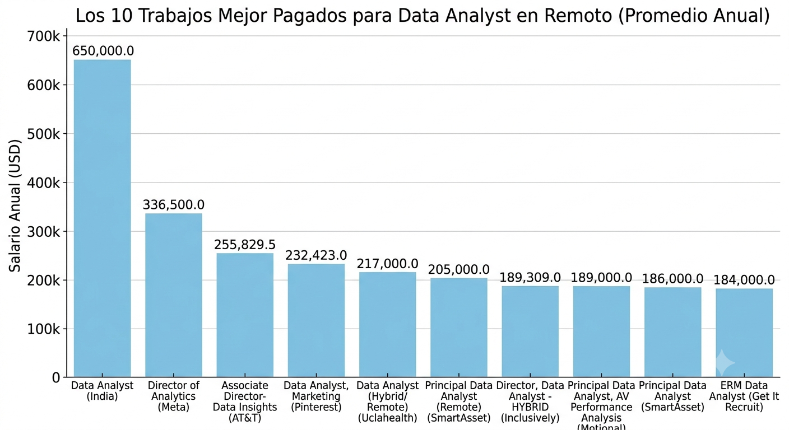
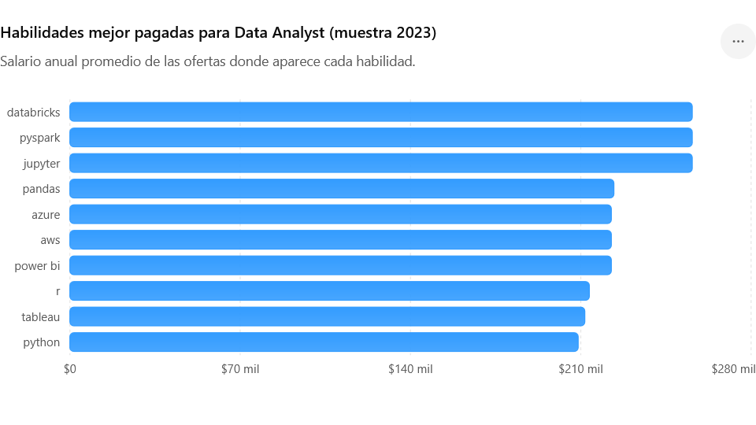
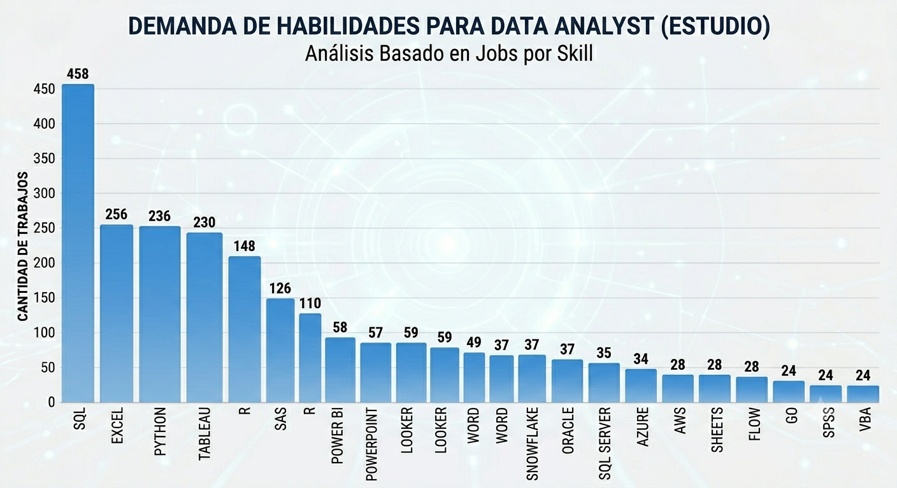
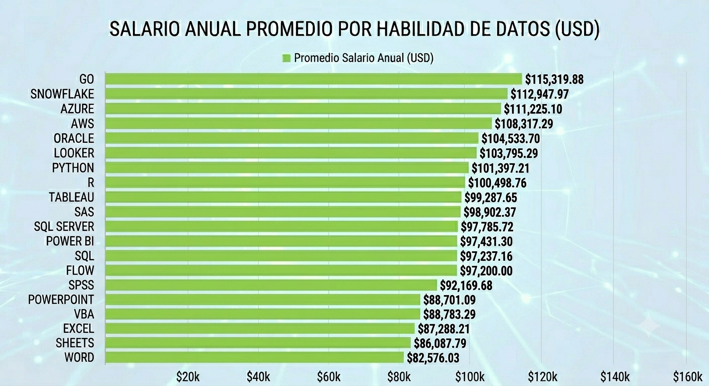

# SQL Data Project: Jobs Analysis

This project analyzes data about job postings for Data Analysts. It uses SQL queries to find important information about salaries, skills, and job opportunities.

## Project Structure

- **csv_files/**: Contains the compressed data files for GitHub compatibility
  - `data_sets.zip` - Compressed archive containing all CSV files:
    - `company_dim.csv` - Company information
    - `job_postings_fact.csv` - Job posting details
    - `skills_dim.csv` - Available skills
    - `skills_job_dim.csv` - Skills required for each job
  - **Note:** Extract the ZIP file to access the CSV files before loading them into the database

- **sql_load/**: Contains scripts to set up the database
  - `1_create_database.sql` - Creates the database
  - `2_create_tables.sql` - Creates the tables
  - `3_modify_tables.sql` - Modifies table structure if needed

- **project_sql/**: Contains the analysis queries (see details below)

## Tools I Used
- **SQL**: the main tool. Allowing me to build the queries to extract the information from the database.
- **PostgreSQL**: the chosen database management system.
- **Visual Studio Code**: used for excecute my SQL queries.
- **Git & GitHub**: essential for version control and share my queries and analytics.

## SQL Queries

### Q1: Top Paying Data Analyst Jobs

**File:** `q1_top_paying_jobs.sql`

**What it does:**
- Finds the top 10 highest-paying Data Analyst jobs available remotely
- Shows jobs that have a salary listed in the database
- Displays information like job title, company name, salary, and location

**Why it's useful:**
- Helps understand what the best-paying opportunities are for Data Analysts
- Shows salary expectations in the field

---

### Q2: Top Paying Job Skills

**File:** `q2_top_paying_job_skills.sql`

**What it does:**
- Shows the skills required for the top 10 highest-paying Data Analyst jobs
- Each skill is listed with the job that requires it
- Organized by salary from highest to lowest

**Why it's useful:**
- Tells you what skills are most important for high-paying positions
- Helps you understand what to learn to get better jobs

---

### Q3: Top Demanded Skills

**File:** `q3_top_demanded_skills.sql`

**What it does:**
- Finds the top 5 most requested skills in Data Analyst job postings
- Counts how many times each skill appears in job listings
- Shows results in uppercase for clarity

**Why it's useful:**
- Shows which skills are most popular in the job market
- Helps you know what most companies are looking for

**Expected results:**

| SKILL NAME | DEMAND  |
| :--- | :---: |
| SQL  | 24099   |
| EXCEL | 15154 |
| PYTHON | 14246 |
| TABLEAU | 12112 |
| POWER BI | 10156 |

---

### Q4: Top Paying Skills

**File:** `q4_top_paying_skills.sql`

**What it does:**
- Calculates the average salary for each skill
- Only looks at jobs with a salary listed
- Shows which skills have the highest average pay

**Why it's useful:**
- Helps identify which skills lead to higher salaries
- Guides your learning decisions based on earning potential

**Expected results:**

| SKILL | AVG SALARY  |
| :--- | :---: |
| SVN  | 400000   |
| SOLIDITY | 179000 |
| COUCHBASE | 160515 |
| DATAROBOT | 155485 |
| GOLANG | 155000 |
| MXNET  | 149000   |
| DPLYR | 147633 |
| VMWARE | 147500 |
| TERRAFORM | 146733 |
| TWILIO | 138500 |

---

### Q5: Optimal Skills to Learn

**File:** `q5_optimal_skills_to_learn.sql`

**What it does:**
- Combines information about skill demand and skill salaries
- Shows skills that are both:
  - Highly requested in job postings
  - Associated with high average salaries
- Organized by number of job postings and salary

**Why it's useful:**
- Identifies the "best" skills to learn for a Data Analyst career
- Balances popularity with earning potential
- Helps you focus your learning on skills that matter most

---

## How to Use

1. Set up the database using the scripts in the `sql_load/` folder
2. Load the data from the `csv_files/` folder
3. Run the queries in the `project_sql/` folder to analyze the data
4. Review the results to answer career-related questions about Data Analyst positions

## Key Insights

This project helps answer important questions:
- What are the best-paying jobs for Data Analysts?
- What skills do these high-paying jobs require?
- Which skills are most in demand?
- Which skills pay the most?
- What skills should I focus on learning?

## Additional Resources

- **simple_sql/**: Contains basic SQL queries used as the foundation for this project. These simple queries were developed first to explore the data and understand the database structure. They served as the basis for building the more advanced queries in the `project_sql/` folder.
